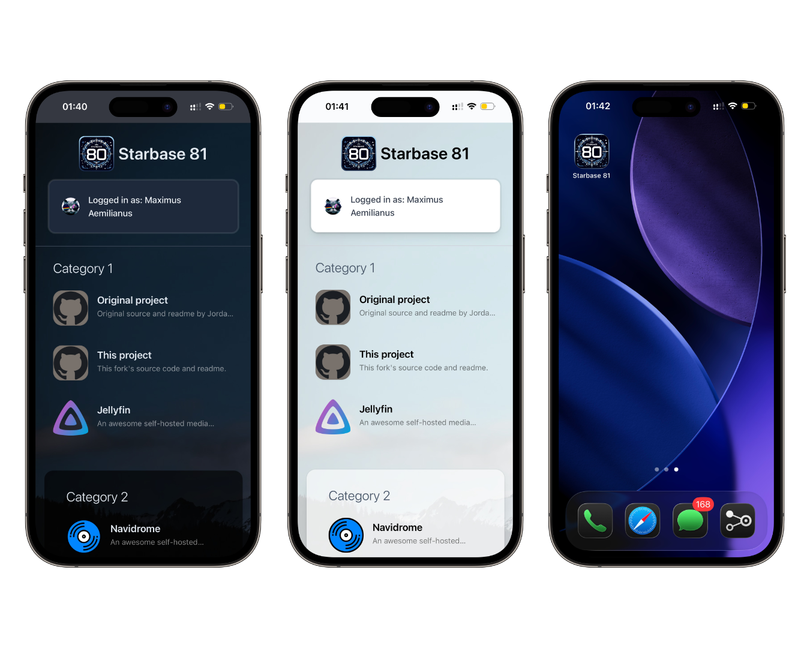
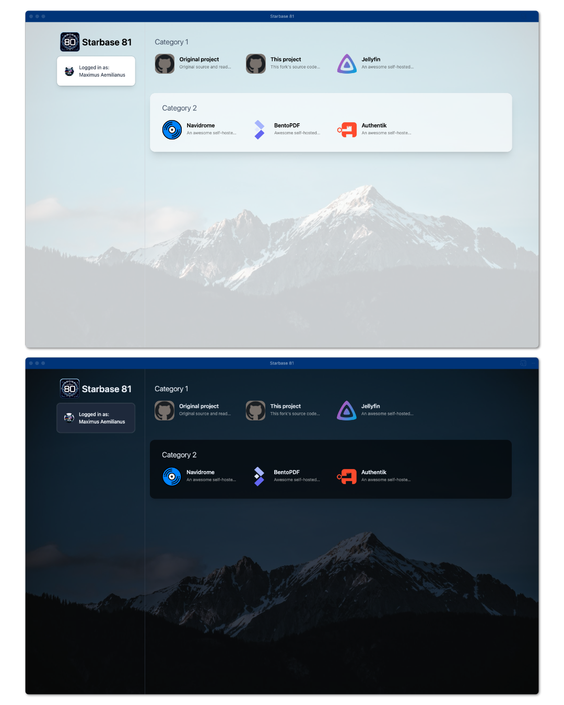

# Starbase 81

> Note: This project is **not thoroughly tested**, and there are **no guarantees of maintenance**. I made this for personal use.

A modified fork of [Starbase-80](https://github.com/notclickable-jordan/starbase-80) — a sleek, fast-loading homepage for Docker containers, services, and links.

It's a fast and simple dashboard/homepage for your links or self-hosted services.

---

## 🖼️  Preview

### [Live demo](https://suckharder.github.io/sb81-demo/)



---

## ✨ Features

* ⚡ Fast-loading dashboard for services and links
* 🌙 Dark mode that follows your OS theme
* 🛠️ Configurable via a JSON file (restart container after changes)
* 🖼️ Background image support (local or online)
* 👤 Authentik login widget (optional)
* 📱 Progressive Web App (PWA) functionality (optional)

---

# ⚡ Quickstart

```bash
# Clone the repo
git clone https://github.com/suckharder/starbase-81

# Get inside the folder
cd starbase-81

# Modify docker-compose.yml and config.json to your liking. - or don't if you just want to check it out quickly - it's ready to go with example configs.

# Start the container
sudo docker compose up -d
```

---

# "📖 Quickdocs"

You can find the original project (and full documentation) here:
[Starbase-80 GitHub](https://github.com/notclickable-jordan/starbase-80)

This README mainly focuses on **changes and additions** made in Starbase-81.

You can find a reference for all the environmental variables as a comment in the compose file.

## 🐳 Docker Environment variables

| Variable                 | Required | Default                | Notes                                                                                                                            |
| ------------------------ | -------- | ---------------------- | -------------------------------------------------------------------------------------------------------------------------------- |
| TITLE                    | True     | My Website             | Set to TITLE= to hide the title                                                                                                  |
| LOGO                     | True     | /logo.png              | Set to LOGO= to hide the logo                                                                                                    |
| HEADER                   |          | true                   | Set to false to hide the title and logo                                                                                          |
| HEADERLINE               |          | true                   | Set to false to turn off the header border line                                                                                  |
| CATEGORIES               |          | normal                 | Set to "small" for smaller, uppercase category labels                                                                            |
| BGCOLOR                  |          | rgba(248, 250, 252, 0.8) | Page background color in light mode. Set to any color using the RGBA syntax.                             |
| BGCOLORDARK              |          | rgba(3, 7, 18, 0.8) | Page background color in dark mode. Set to any color using the RGBA syntax.                               |
| CATEGORYBUBBLECOLORLIGHT |          | rgba(255, 255, 255, 0.6)    | Background color for category bubbles (if enabled) in light mode. Set to any color using the RGBA syntax. |
| CATEGORYBUBBLECOLORDARK  |          | rgba(0, 0, 0, 0.6)    | Background color for category bubbles (if enabled) in dark mode. Set to any color using the RGBA syntax.  |
| NEWWINDOW                |          | true                   | Set to false to not have links open in a new window. PWA overrides this to always false.                                                                              |
| THEME                    |          | auto                   | Set to "auto", "light", or "dark" to force a display mode (e.g. dark mode)                                                       |
| HOVER                    |          | none                   | Set to "underline" for an underline effect on titles when hovering/focusing on that service                                      |
| BGIMAGE                   |          | url()                   | Ommiting this variable will produce no image. For local image always use "url(/background.jpg)". More info below.                                     |
| SHOWAUTHWIDGET                   |          | false                   | Set to "true" to display the Authentik Login widget. Additional configuration required. More info below.                                     |
| AUTHENTIKURL                    |          | auth.example.com                  | The address of your Authentik server. Do not use a scheme (https://) or a trailing slash.                                      |
| PWA                   |          | false                   | Set to "true" to enable PWA functionality. More info below.                                      |
| PWA_THEME                   |          | #003478                   | Hex code of your PWA theme.                                      |

## 🗂 Docker Volumes (bind mounts)

| Path                        | Required | Notes                                                                         |
| --------------------------- | -------- | ----------------------------------------------------------------------------- |
| ./config.json:/app/src/config/config.json | true     | Configuration with list of sites and links                                    |
| ./public/favicon.ico:/app/public/favicon.ico    |          | Website favicon. **ALWAYS** use a "favicon.ico" file. Simply replace the file in ./public                                                              |
| ./public/logo.png:/app/public/logo.png       |          | Logo in the header . **ALWAYS** use a "logo.png" file. Simply replace the file in ./public                                                           |
| ./public/background.jpg:/app/public/background.jpg       |    for local image      | Background image. Local images: **ALWAYS** use a "background.jpg" file. Simply replace the file in ./public                                                            |
| ./public/icons:/app/public/icons          |          | Or wherever you want to put them, JSON icon paths are relative to /app/public |

## 🖼️ Background Image Support Information

You can now now properly pimp out your dashboard with a background image!

### Supported Modes

1. **Local Image**
2. **Online Image**

### Local Image

Use a JPG file format, with the filename background.jpg, placed inside ./public

Set the Docker environment variable:

```env
BGIMAGE=url(/background.jpg)
```

* You can simply replace `background.jpg` inside `./public`.
* Use a .jpg format, do NOT rename, url(/background.jpg) is ALWAYS expected!

> ⚠️ Must mount the image as a Docker volume:
> `./public/background.jpg:/app/public/background.jpg`

### Online Image

If you wish to use an image from the internet, simply change the url() property to include the link:

```env
BGIMAGE=url(https://images.pexels.com/photos/1054218/pexels-photo-1054218.jpeg)
```

* Volume mount is **optional** in this mode.

### Notes

* Omitting `BGIMAGE` deploys the dashboard **without a background image**.
* The background is overlaid with the configured background color to improve readability That is the reason for RGBA, it's easy to understand. Yes, I know Tailwind supports alpha too.
* For a more prominent image, reduce the transparency of `BGCOLOR` and `BGCOLORDARK` (or set to 0 for no overlay).

---

## 👤 Authentik Widget Information

> Requires additional Authentik configuration. Keep reading.
> What is authentik? [https://goauthentik.io/](https://goauthentik.io/)

I implemented a small, very simple widget that displays your Authentik Log-In status

* Displays Authentik login status in the header.
* If **not logged in**, shows a button to open the login page.
* If **logged in**, shows your name and avatar.

The authentik widget is displayed in the header. Disabling the header will also disable the widget, even if SHOWAUTHWIDGET is set to true.

### Enable Authentik Widget

```env
SHOWAUTHWIDGET=true
```
Don't forget to specify the URL of your Authentik server by setting:

```env
AUTHENTIKURL=auth.example.com
```

> Note: `AUTHENTIKURL` is **without scheme, path, or trailing slash!**

### Authentik Config

You **must** set CORS headers for authentik, to allow your Starbase-81 instance URL.
This is not possible in Authentik directly, they need to be set via your **reverse proxy**.

Example for **Nginx Proxy Manager (NPM)**:

1. Open the proxy host for your Authentik server
2. In "Custom location", add custom location `/`, same "hostname" and "port" as the whole proxy host.
3. In "Advanced config" add these lines:

```nginx
add_header 'Access-Control-Allow-Origin' 'https://example.com' always;
add_header 'Access-Control-Allow-Credentials' 'true' always;
```

> Replace `https://example.com` with your Starbase-81 instance URL.


## 📱PWA Support Information
> Note: Needs additional testing. Seems to work well under Edge on MacOS, and iOS (iPhone).

If you're using you own logo.png, it **HAS TO BE EXACTLY 512x512 px.**

PWA mode always opens links in the same window, since being redirected back to your browser would kind of defeat the point of a PWA.

Just set PWA to true to enable.
```env
PWA=true
```
Optionally, change your theme color.
```env
PWA_THEME=#003478
```
---

## Other Notable Changes

### Color Syntax

* All the colors that are changeable with environmental variables now follow now use **RGBA syntax**:

```env
BGCOLORDARK=rgba(3, 7, 18, 0.8)
```
---
# Configuration (mostly copied from notclickable-jordan/starbase-80)

## Sample config.json

```json
[
  {
    "category": "Category 1",
    "services": [
      {
				"name": "Original project",
				"uri": "https://github.com/notclickable-jordan/starbase-80",
				"description": "Original source and readme by Jordan Roher.",
				"icon": "selfhst-github",
        "iconBG": "stone-500",
        "iconBubble": true
			},
      {
				"name": "This project",
				"uri": "https://github.com/suckharder/starbase-81",
				"description": "This fork's source code and readme.",
				"icon": "selfhst-github",
        "iconBG": "stone-500",
        "iconBubble": true
			},
      {
        "name": "Jellyfin",
        "uri": "https://jellyfin.org",
        "description": "An awesome self-hosted media server.",
        "icon": "selfhst-jellyfin",
        "iconBubble": false
      }
    ]
  },
  {
    "category": "Category 2",
    "bubble": true,
    "services": [
      {
        "name": "Navidrome",
        "uri": "https://www.navidrome.org",
        "description": "An awesome self-hosted music server.",
        "icon": "selfhst-navidrome",
        "iconBubble": false
      },
      {
        "name": "BentoPDF",
        "uri": "https://www.bentopdf.com/",
        "description": "Awesome self-hosted PDF tools.",
        "icon": "selfhst-bentopdf",
        "iconBubble": false
      },
      {
        "name": "Authentik",
        "uri": "https://goauthentik.io",
        "description": "An awesome self-hosted auth solution.",
        "icon": "selfhst-authentik",
        "iconBubble": false
      }
    ]
  }
]

```

## Category variables

| Name              | Default | Required | Notes                                                                                                                                                     |
| ----------------- | ------- | -------- | --------------------------------------------------------------------------------------------------------------------------------------------------------- |
| category          |         |          | Displays above the list of services                                                                                                                       |
| bubble            | false   |          | Shows a bubble around category                                                                                                                            |
| bubbleBGLight     |         |          | Background color for category bubbles. Must be a [Tailwind color](https://tailwindcss.com/docs/background-color) (do not prefix with `bg-`).              |
| bubbleBGDark      |         |          | Background color for category bubbles in dark mode. Must be a [Tailwind color](https://tailwindcss.com/docs/background-color) (do not prefix with `bg-`). |
| iconBubblePadding | false   |          | If `true`, adds a slight padding around each service's icons which are in a bubble.                                                                       |
| services          |         | true     | Array of services                                                                                                                                         |

## Service variables

| Name              | Default | Required | Notes                                                                                                                                                                                                                                                         |
| ----------------- | ------- | -------- | ------------------------------------------------------------------------------------------------------------------------------------------------------------------------------------------------------------------------------------------------------------- |
| name              |         | true     | Title of service                                                                                                                                                                                                                                              |
| uri               |         | true     | Hyperlink to resource                                                                                                                                                                                                                                         |
| description       |         |          | 2-3 words which appear below the title                                                                                                                                                                                                                        |
| icon              |         |          | Relative URI, absolute URI, service name ([Dashboard icon](https://github.com/walkxcode/dashboard-icons)), `mdi-` service name ([Material Design icon](https://icon-sets.iconify.design/mdi/)), `selfhst-` icon name [selfh.st icon](https://selfh.st/icons/) |
| iconBG            |         |          | Background color for icons. Hex code or [Tailwind color](https://tailwindcss.com/docs/background-color) (do not prefix with `bg-`).                                                                                                                           |
| iconColor         |         |          | Only used as the fill color for Material Design icons. Hex code or [Tailwind color](https://tailwindcss.com/docs/background-color) (do not prefix with `bg-`).                                                                                                |
| iconBubble        | true    |          | If `false` the bubble and shadow are removed from the icon                                                                                                                                                                                                    |
| iconBubblePadding | false   |          | Overrides `bubblePadding` set at the category level                                                                                                                                                                                                           |
| iconAspect        | square  |          | Set to `"width"` or `"height"` to constrain the icon to the width or height of the icon, respectively                                                                                                                                                         |
| newWindow         |         |          | Set to `true` or `false` to override the environment variable `NEWWINDOW` for this service. ***Didn't notice this exists while making changes - I don't know how this will behave, use at your own risk.***                                                                                                                                                                    |

# Icons

## Volume / bind mount

Create a volume or bind mount to a subfolder of `/app/public` and specify a relative path.

```bash
# Your folder
compose.yml
- icons
  - jellyfin.jpg
  - ghost.jpg
  - etc

# Bind mount
./icons:/app/public/icons

# Icon in config.json
"icon": "/icons/jellyfin.jpg"
```

## Dashboard icons

Use [Dashboard icons](https://github.com/walkxcode/dashboard-icons) by specifying a name without any prefix.

```bash
# Icon in config.json
"icon": "jellyfin"
```

## Material design

Use any [Material Design icon](https://icon-sets.iconify.design/mdi/) by prefixing the name with `mdi-`.

Fill the icon by providing an "iconColor."

Use "black" or "white" for those colors.

```bash
# Icon in config.json
"icon": "mdi-cloud",
"iconColor": "black"
```

## Selfh.st icons

Use any [selfh.st icon](https://selfh.st/icons/) by prefixing the name with `selfhst-`.

```bash
# Icon in config.json
"icon": "selfhst-couchdb"
```
# Docker

## Sample Docker compose

```yaml
services:
    starbase-81:
        build: ./starbase-81-src
        image: suckharder/starbase-81:preview
        container_name: starbase-81
        ports:
            - 80:4173
        environment:
            - TITLE=Starbase 81
            - LOGO=/logo.png
            - BGIMAGE=url(/background.jpg)
          # ALL ENVIRONMENTAL VARIABLES - prefilled with default values
          # 
          # - TITLE=Starbase 81
          # - LOGO=/logo.png
          # - HEADER=true
          # - HEADERLINE=true
          # - HEADERTOP=false
          # - CATEGORIES=normal
          # - THEME=auto
          # - BGCOLOR=rgba(248, 250, 252, 0.8)
          # - BGCOLORDARK=rgba(3, 7, 18, 0.8)
          # - BGIMAGE=url()
          # - CATEGORYBUBBLECOLORLIGHT=rgba(255, 255, 255, 0.6)
          # - CATEGORYBUBBLECOLORDARK=rgba(0, 0, 0, 0.6)
          # - NEWWINDOW=true
          # - HOVER=none
          # - SHOWAUTHWIDGET=false
          # - AUTHENTIKURL=auth.example.com
          # - PWA=false
          # - PWA_THEME=#003478
        restart: unless-stopped
        volumes:
            - ./config.json:/app/src/config/config.json
            - ./public/favicon.ico:/app/public/favicon.ico
            - ./public/logo.png:/app/public/logo.png
            - ./public/background.jpg:/app/public/background.jpg
            - ./public/icons:/app/public/icons

```
---

## 💖 Credits

* Original Starbase-80 by [notclickable-jordan](https://github.com/notclickable-jordan)
*  PWA guide by [Rishi Vishwakarma](https://dev.to/prorishi/your-static-site-to-a-pwa-24dl)

---

> PS: I hope I didn’t forget anything important!